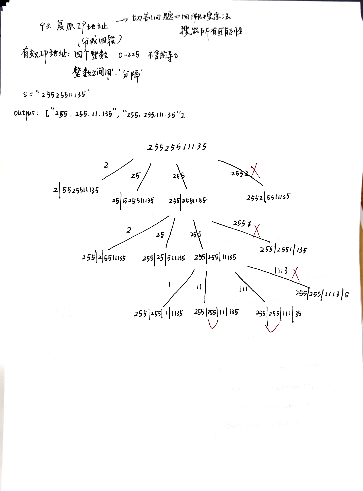
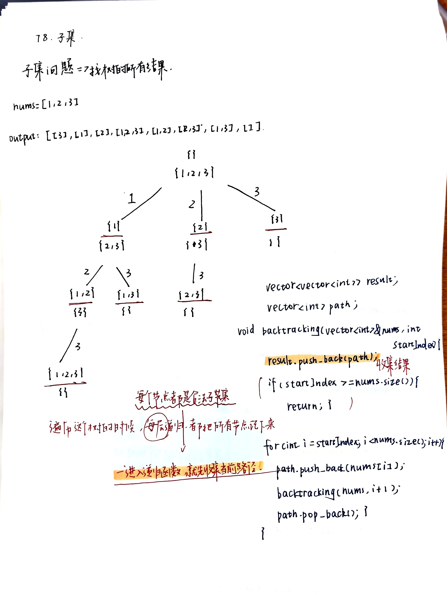
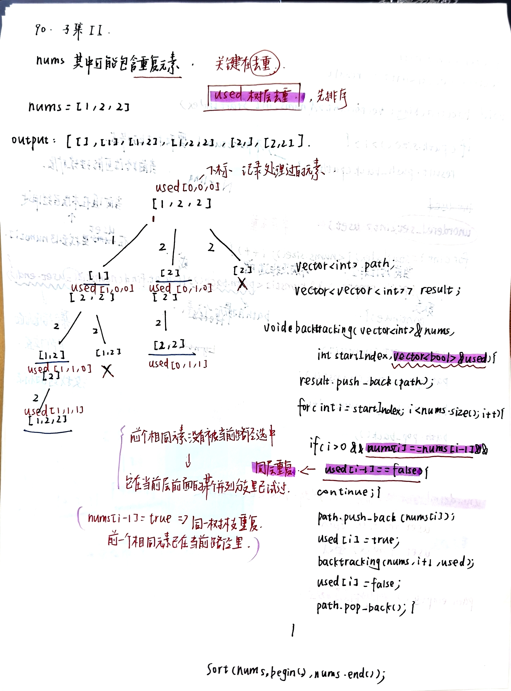

# 回溯进阶：切割与子集问题
- [93.复原IP地址](https://leetcode.cn/problems/restore-ip-addresses/description/)
  - 分割型回溯：枚举切割位置 + 判断当前这一段是否合法
  - 尝试一种切法 -> 继续递归 -> 不行就回退
  
- [78.子集](https://leetcode.cn/problems/subsets/description/)
  - 每次进入递归函数，说明我们到了树上的一个节点，而这个节点就对应一个合法子集
  - 一进入递归函数就收集结果
    
- [90.子集II](https://leetcode.cn/problems/subsets-ii/description/)
  - 这题先排序，让相同元素相邻。
  - 然后在回溯过程中，对同一树层上的重复元素进行跳过。
  - 具体判断方式是：如果当前元素和前一个元素相同，并且前一个元素没有在当前路径中使用，说明前一个元素已经在本层作为分支尝试过了，当前元素再尝试会生成重复子集，所以直接跳过。
  - 如果前一个元素已经在当前路径中使用，说明当前元素是在同一树枝上展开的，这种情况是合法的，不能跳过。
    
