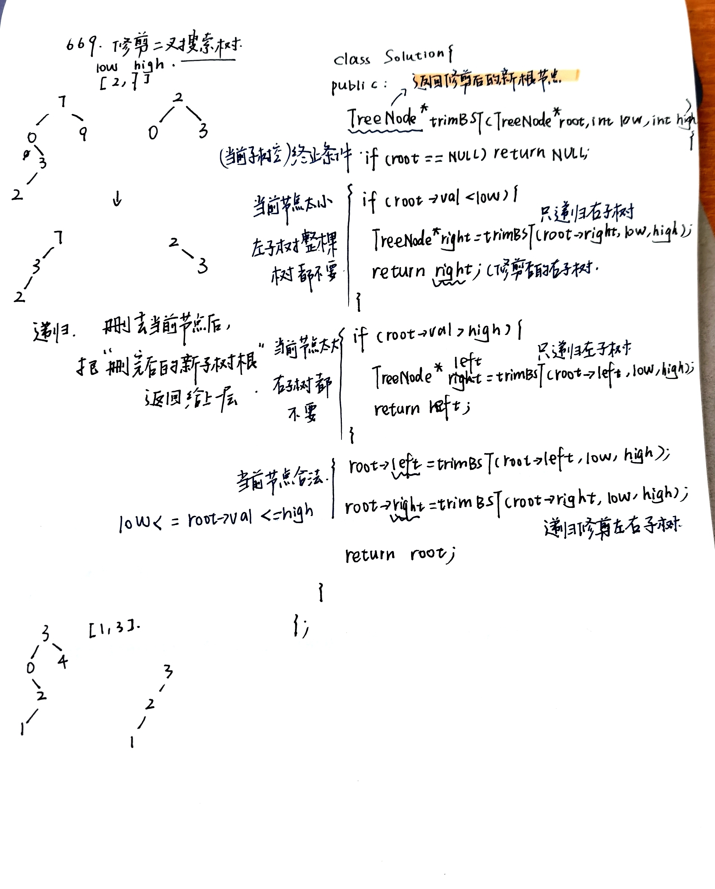
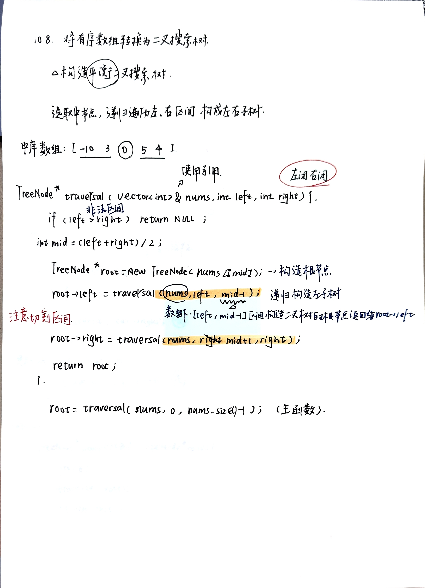
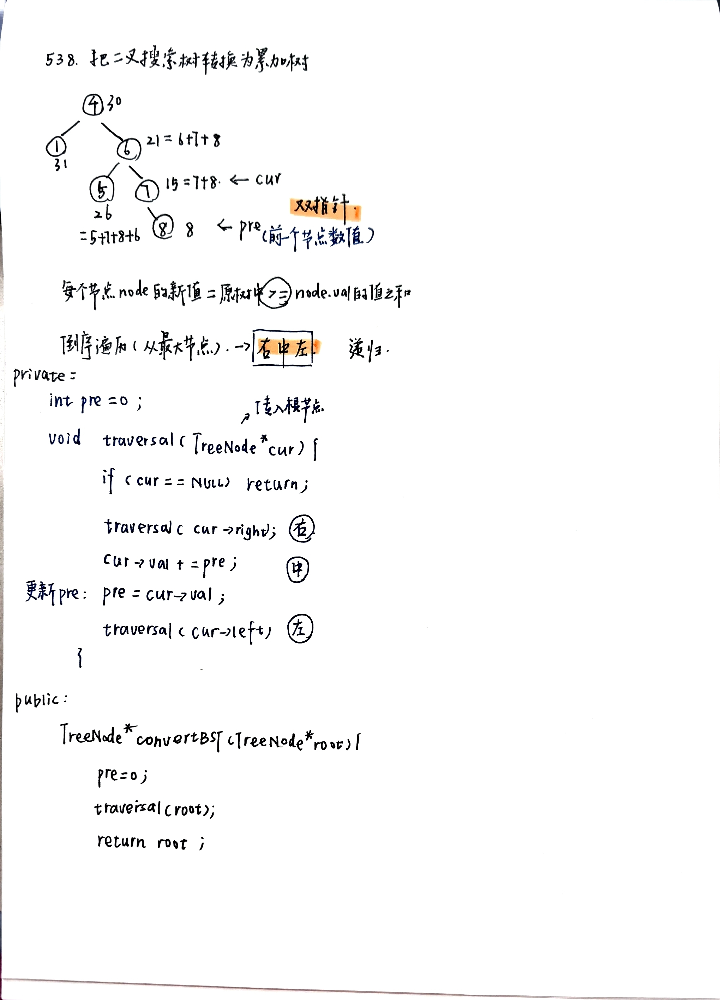

# 二叉搜索树进阶：修剪、构造与累加树
- [669.修建二叉搜索树](leetcode.cn/problems/trim-a-binary-search-tree/description/)**难**
  - 如果当前节点为空，返回空。
  - 如果当前节点值小于 low，说明当前节点和左子树都不可能保留，只需要去右子树继续修剪，并返回修剪后的右子树。
  - 如果当前节点值大于 high，说明当前节点和右子树都不可能保留，只需要去左子树继续修剪，并返回修剪后的左子树。
  - 如果当前节点在区间内，就递归修剪左右子树，并把修剪后的结果重新接回当前节点，最后返回当前节点。
  - 
- [108.将有序数组转换为二叉搜索树](https://leetcode.cn/problems/convert-sorted-array-to-binary-search-tree/description/)**构造平衡二叉搜索树**
  - 选取中间节点，再切割区间，递归遍历左右区间构成左右子树
  - 
- [538.](https://leetcode.cn/problems/convert-bst-to-greater-tree/description/)**我觉得挺难的**
  - 看成有序数组。反中序数组，双指针。
  - 
- summary:
  - 涉及到二叉树的构造，无论普通二叉树还是二叉搜索树一定前序，都是先构造中节点。
  - 求普通二叉树的属性，一般是后序，一般要通过递归函数的返回值做计算。
  - 求二叉搜索树的属性，一定是中序了，要不白瞎了有序性了
  - [sum](https://programmercarl.com/%E4%BA%8C%E5%8F%89%E6%A0%91%E6%80%BB%E7%BB%93%E7%AF%87.html#%E4%BA%8C%E5%8F%89%E6%A0%91%E7%9A%84%E7%90%86%E8%AE%BA%E5%9F%BA%E7%A1%80)
