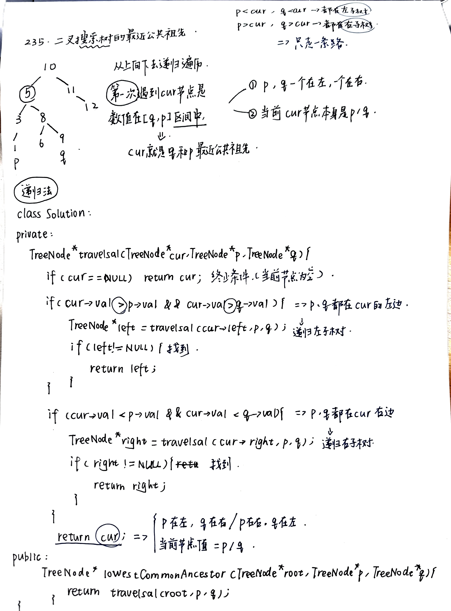
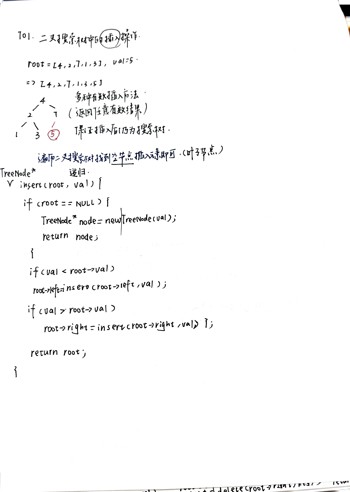
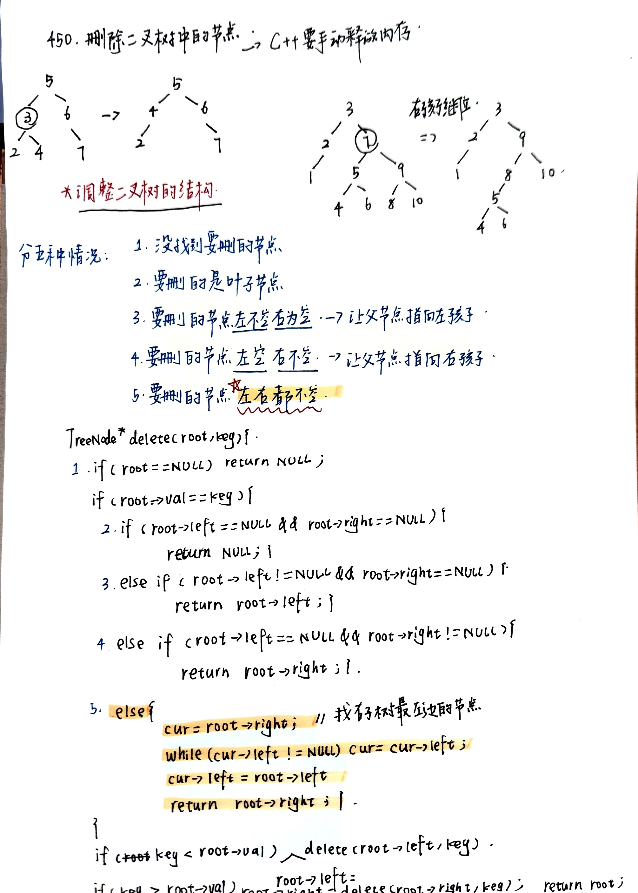

# 二叉搜索树操作：查找、插入与删除
- [235.二叉搜索树的公共祖先](https://leetcode.cn/problems/lowest-common-ancestor-of-a-binary-search-tree/description/)
  - 在 BST 中找最近公共祖先时，
  - 如果两个节点都比当前节点小，就去左边；
  - 如果都比当前节点大，就去右边；否则当前节点就是最近公共祖先
  - 
  - 迭代法：
    ```c++
    while (root) {
    if (都在左边) root = root->left;
    else if (都在右边) root = root->right;
    else return root;
    }
    ```
- [701.二叉搜索树中的插入操作](https://leetcode.cn/problems/insert-into-a-binary-search-tree/description/)
  - 只要遍历二叉搜索树，找到空节点（叶子节点) 插入元素就可以了，那么这道题其实就简单了
  - 
- [450.删除二叉搜索树中的节点](https://leetcode.cn/problems/delete-node-in-a-bst/description/)
  - 搜索树的节点删除要比节点增加复杂的多，有很多情况需要考虑
  - 
