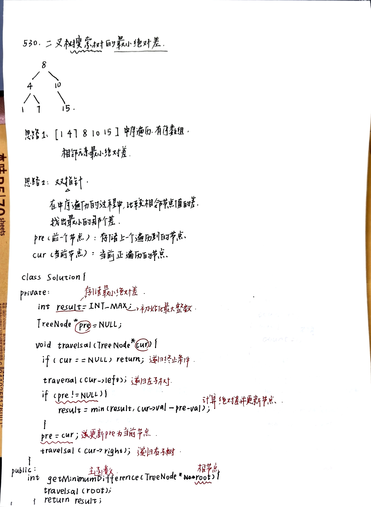
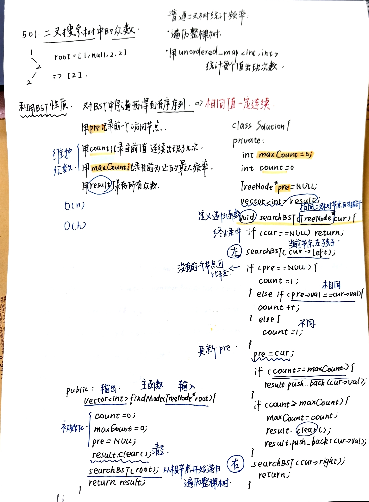
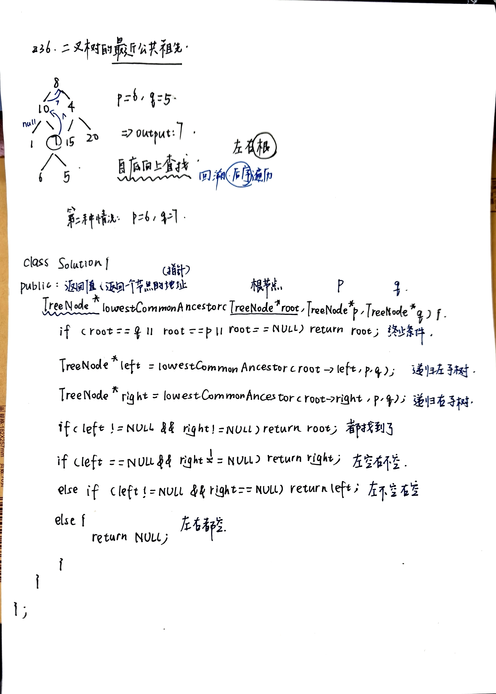

# 二叉树进阶：BST 性质与公共祖先
- [530.最小绝对差](https://leetcode.cn/problems/minimum-absolute-difference-in-bst/description/)
  - 
- [501.二叉搜索树中的众数](https://leetcode.cn/problems/find-mode-in-binary-search-tree/description/)
  - 利用二叉搜索树中序遍历有序的性质，中序遍历整棵树。
  - 用 pre 记录前一个节点，如果当前节点值和前一个相同，就让 count++，否则 count=1。
  - 再用 maxCount 维护最大频率，用 result 保存所有频率等于最大值的节点值。如果发现更大的频率，就清空旧结果并更新。
  - 
- [236.二叉树的最近公共祖先](https://leetcode.cn/problems/lowest-common-ancestor-of-a-binary-tree/submissions/710943837/)
  - 如果当前节点为空，或者当前节点就是 p 或 q，就直接返回当前节点。然后递归去左子树和右子树找。
  - 如果左右子树都找到了结果，说明当前节点就是最近公共祖先。
  - 如果只有一边找到了，就把那一边的结果返回上去。
  - 如果两边都没找到，就返回空。
  - 
