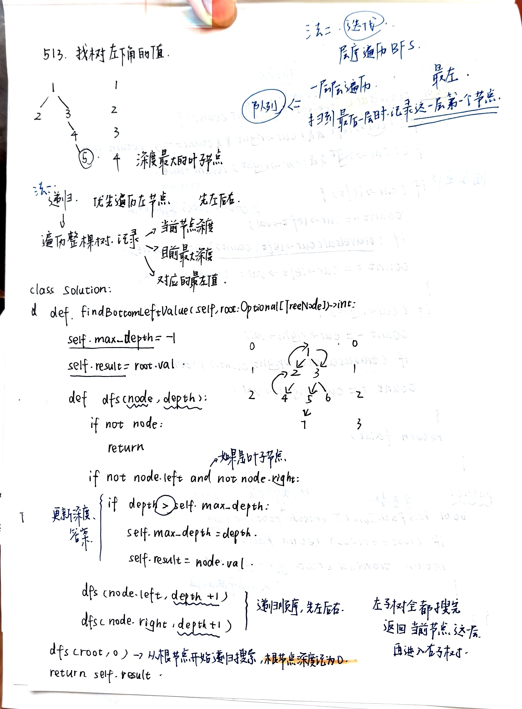
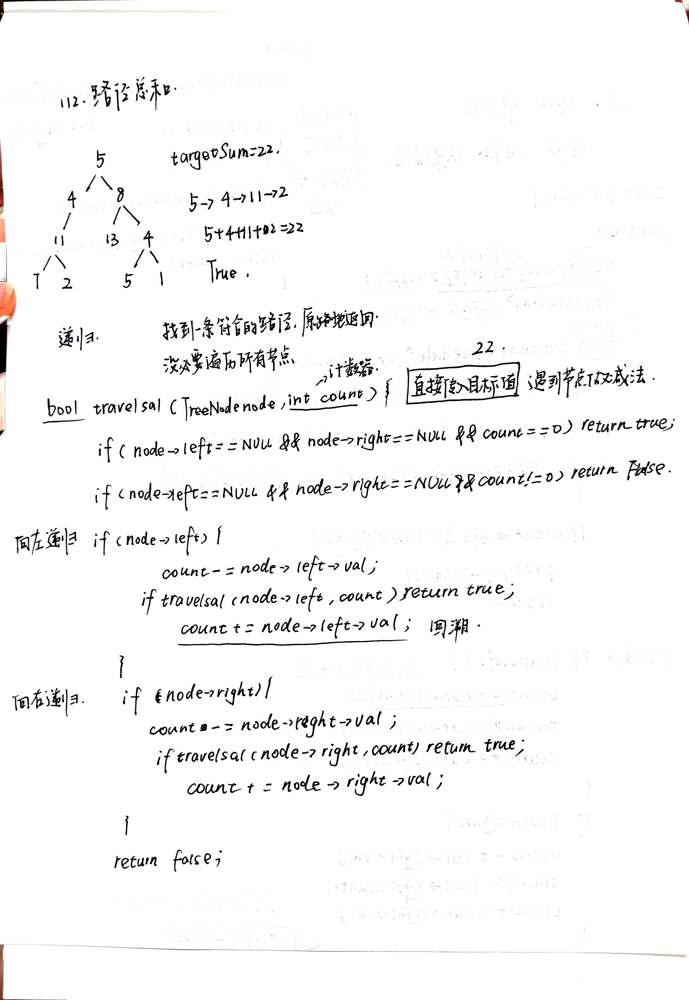
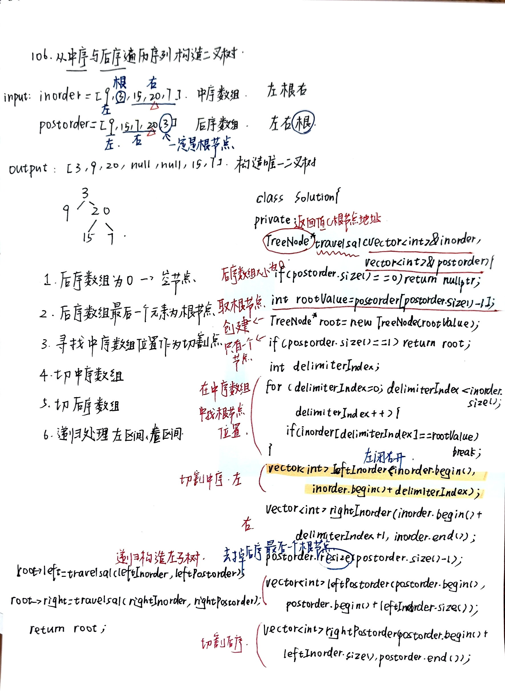

# 二叉树递归：路径判断与构造
- [513找左下角的值](https://leetcode.cn/problems/find-bottom-left-tree-value/)
  - 
  - 
- [112路径总和](https://leetcode.cn/problems/path-sum/)
  - 
  - 
- [106从中序与后序构造二叉树](https://leetcode.cn/problems/construct-binary-tree-from-inorder-and-postorder-traversal/)
  - 
