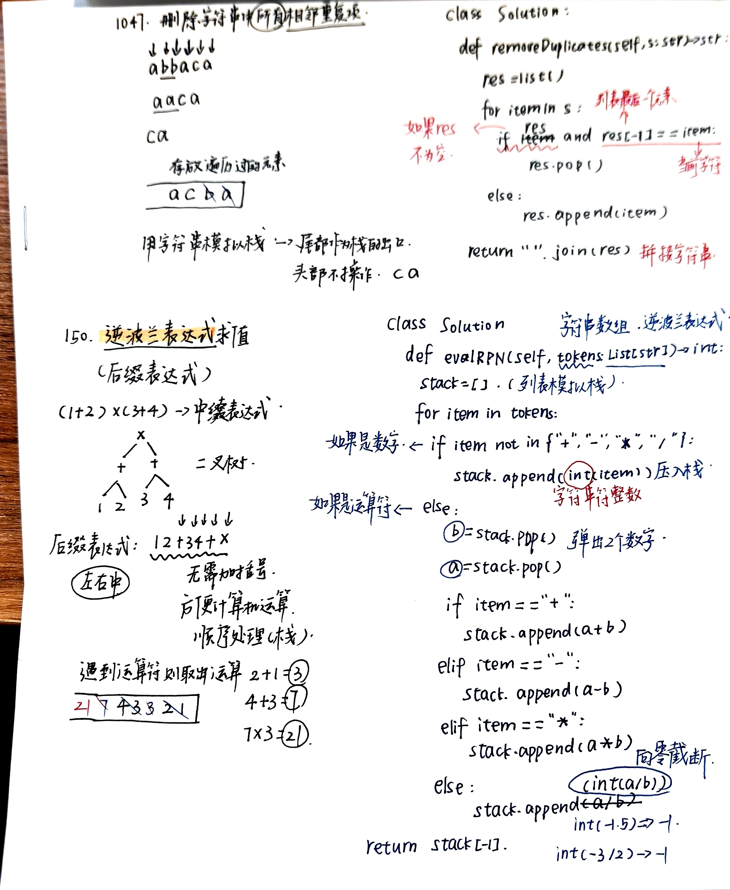
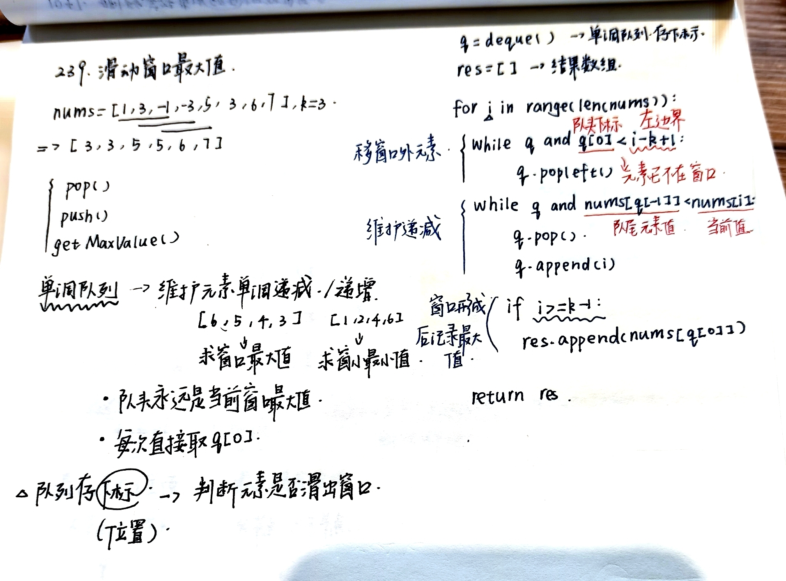
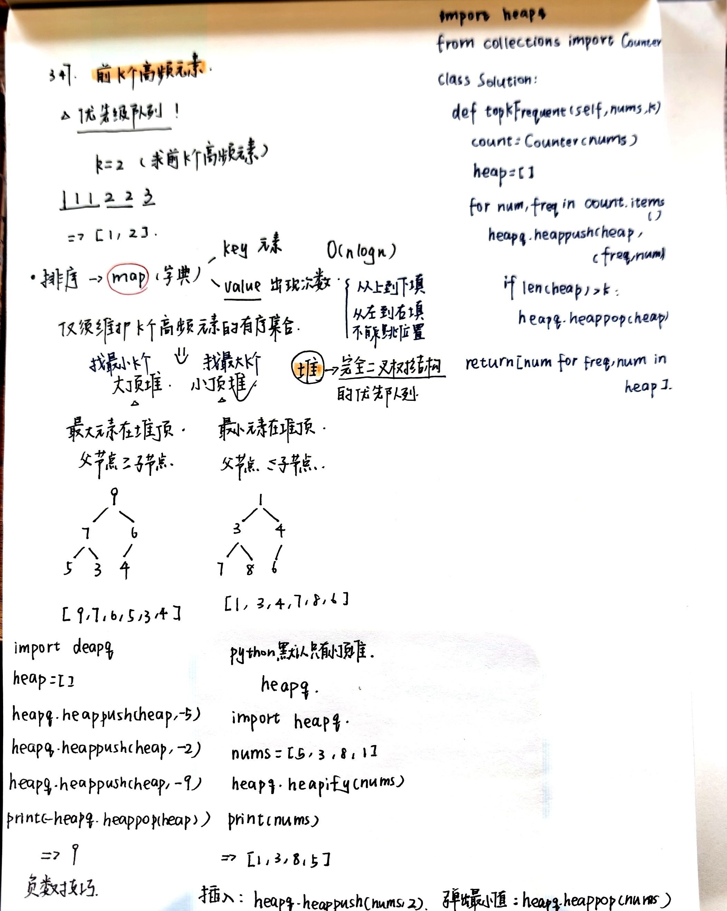

# 栈与队列进阶：单调队列与优先队列
- [150.逆波兰表达式](https://leetcode.cn/problems/evaluate-reverse-polish-notation/description/)
  - 中缀转后缀表达式
  - 
- [239.滑动窗口最大值](https://leetcode.cn/problems/sliding-window-maximum/description/)
  - 用单调队列维护元素递增或递减
    
- [347.前k个高频元素](https://leetcode.cn/problems/top-k-frequent-elements/description/)
  - 优先级队列，维护前k个高频元素
  - 大顶堆小顶堆
   
