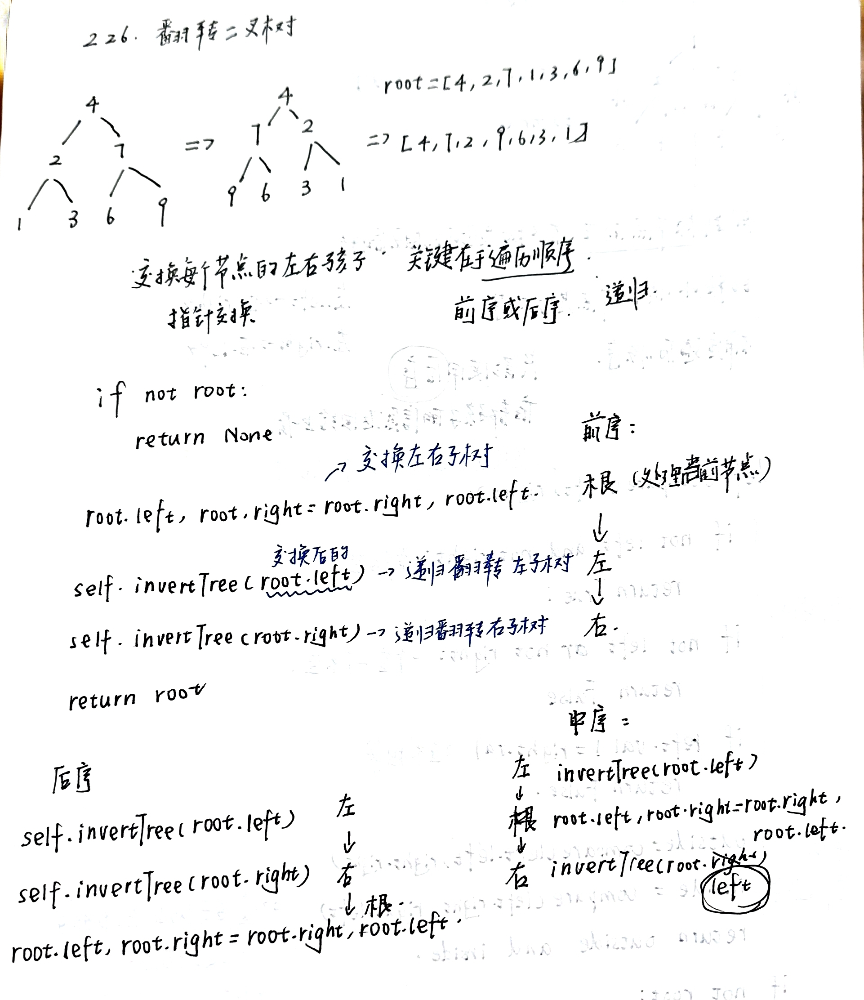

# 二叉树part02
- [226.翻转二叉树](https://leetcode.cn/problems/invert-binary-tree/)
  - 
- [101.对称二叉树](https://leetcode.cn/problems/symmetric-tree/)
  - 
- [104.最大深度](https://leetcode.cn/problems/maximum-depth-of-binary-tree/)
  - 
- [111.最小深度](https://leetcode.cn/problems/minimum-depth-of-binary-tree/)
  - 
