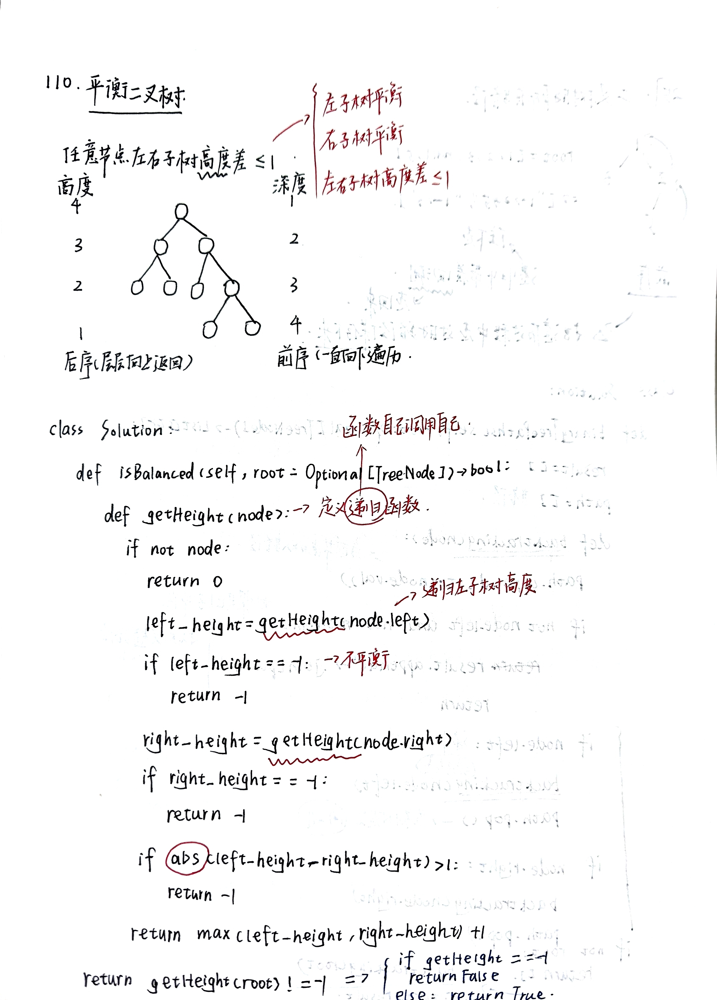
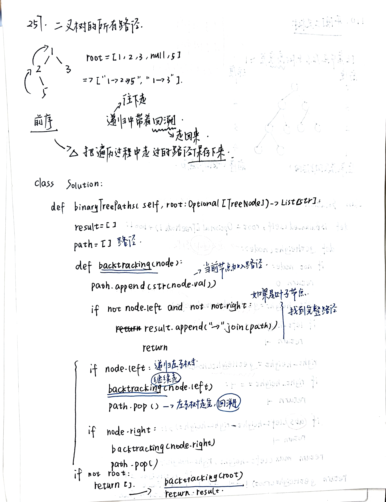

# 二叉树part03
- [110](https://leetcode.cn/problems/balanced-binary-tree/)
  
- [257.](https://leetcode.cn/problems/binary-tree-paths/)
  
- [404.](https://leetcode.cn/problems/sum-of-left-leaves/)
  
- [222.](https://leetcode.cn/problems/count-complete-tree-nodes/)
  
