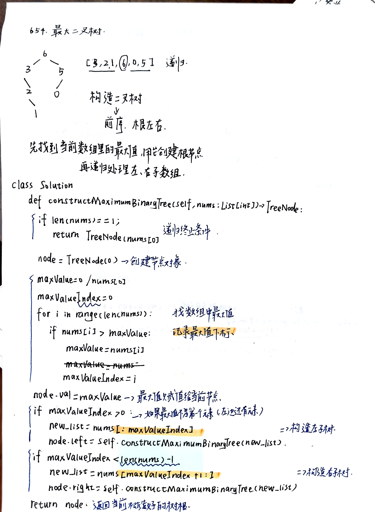
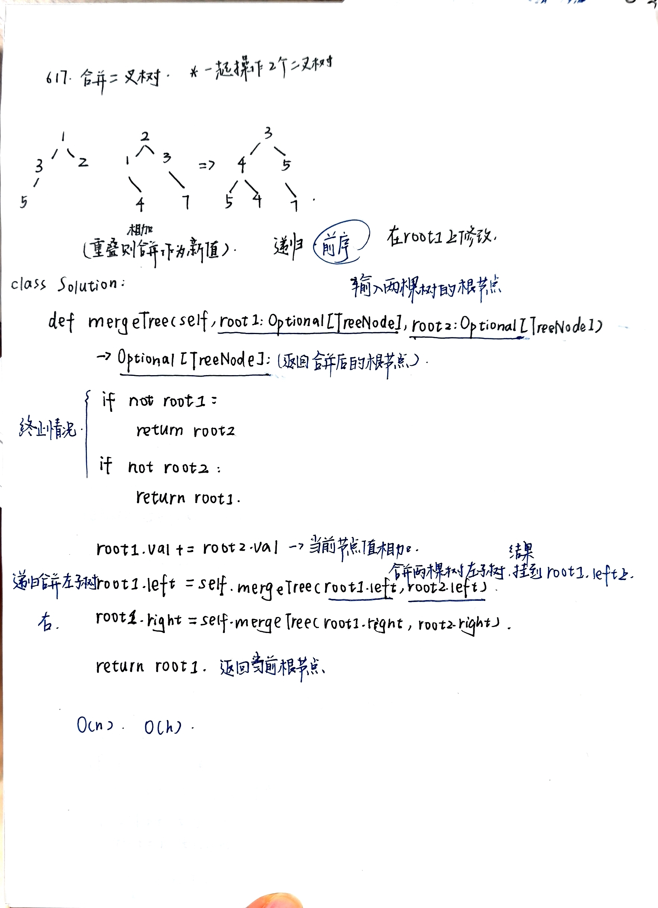
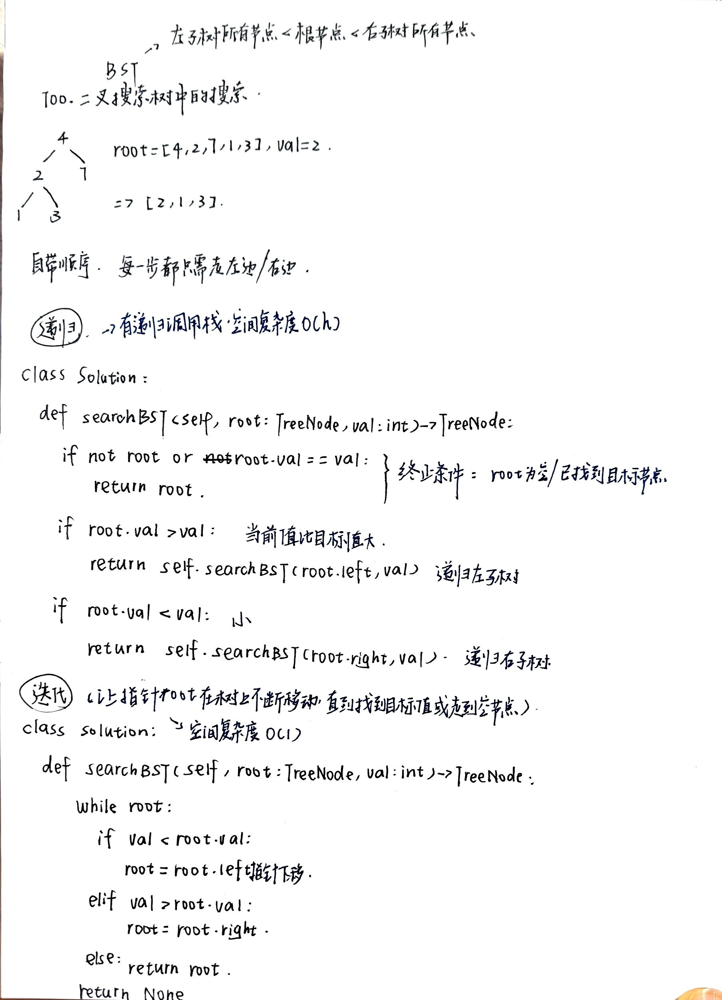
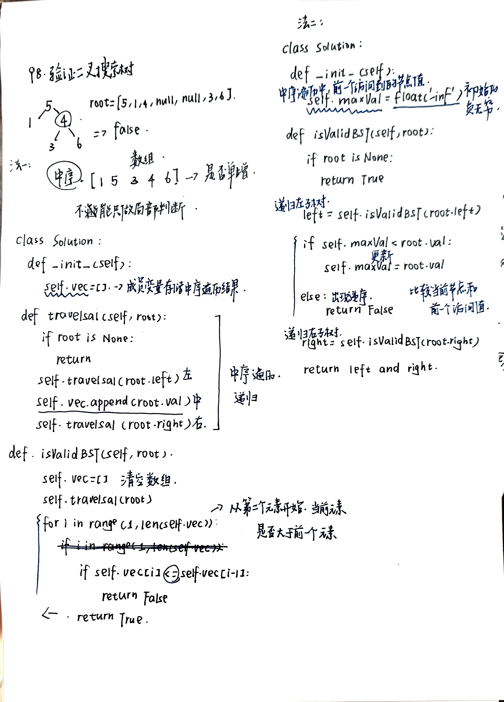

# 二叉树part05
- [654.最大二叉树](https://leetcode.cn/problems/maximum-binary-tree/)
  - 
- [617.合并二叉树](https://leetcode.cn/problems/merge-two-binary-trees/)
  - 
- [700.二叉搜索树中的搜索](https://leetcode.cn/problems/search-in-a-binary-search-tree/)
  - 
- [98.验证二叉搜索树](https://leetcode.cn/problems/validate-binary-search-tree/)
  - 
