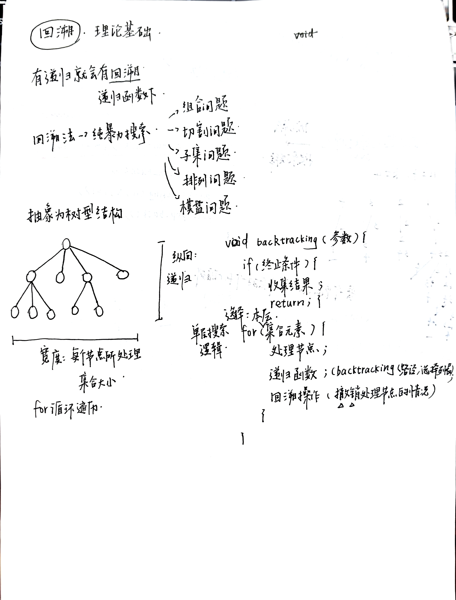
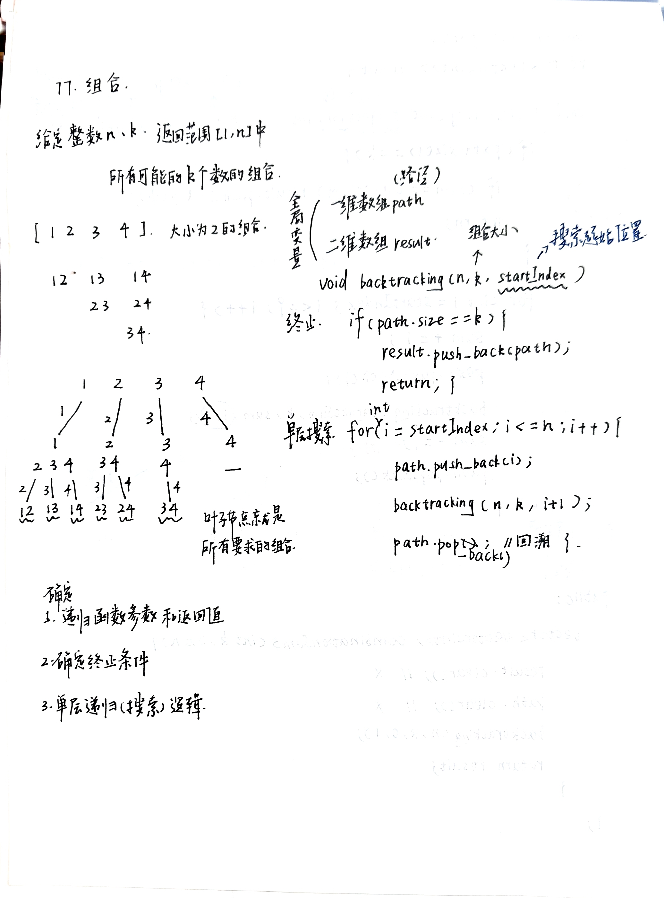
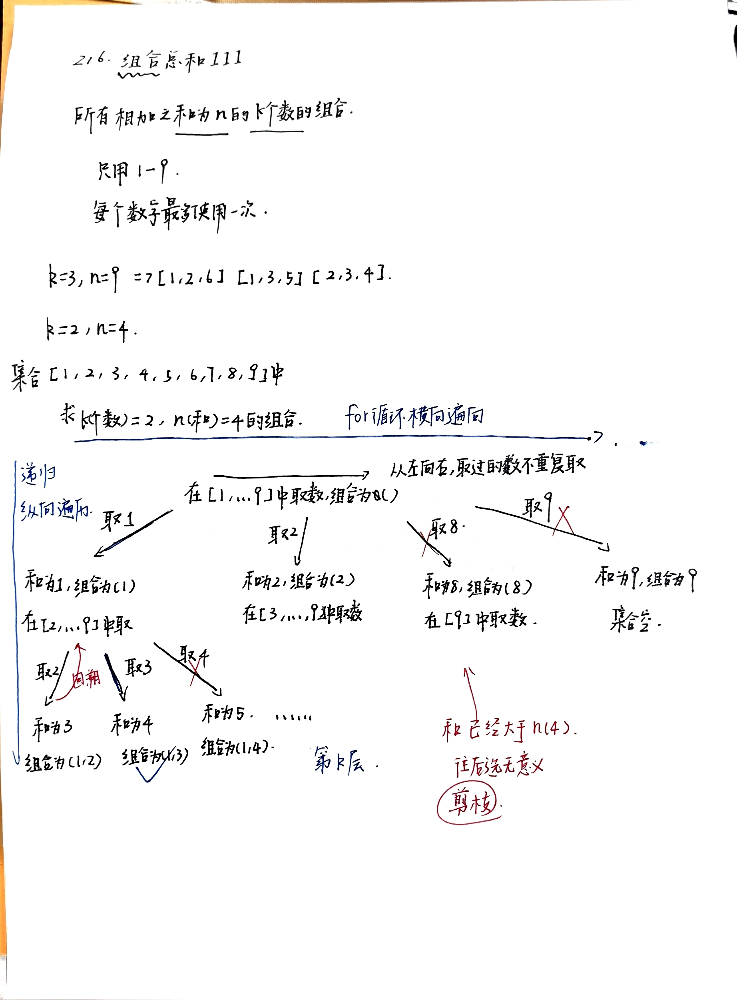
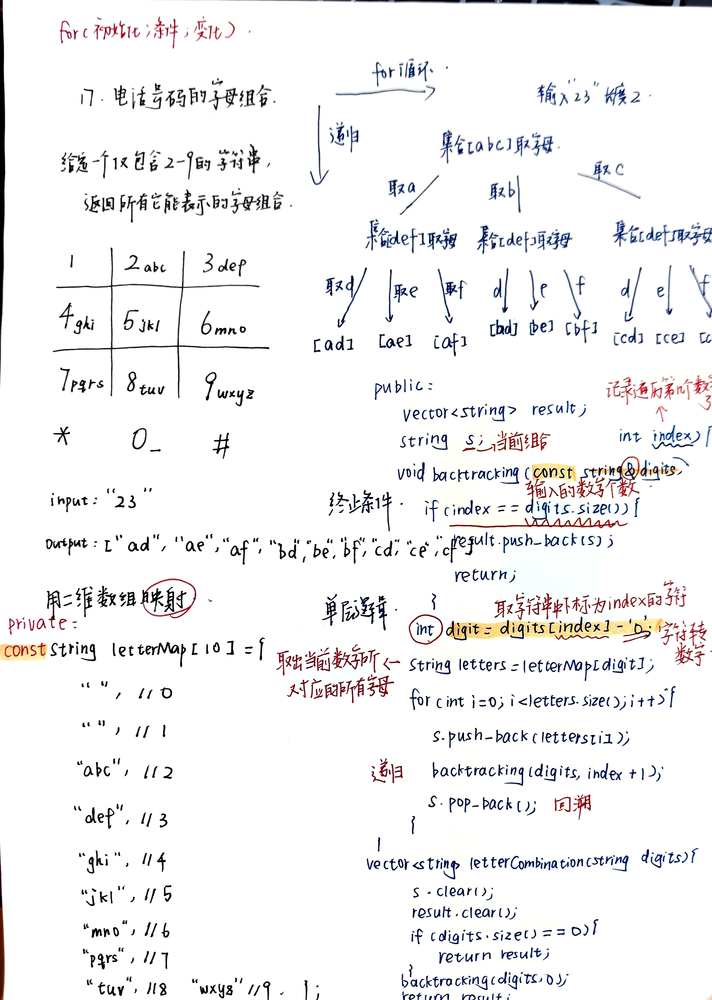

# 回溯part01
- 理论基础

- [77.组合](https://leetcode.cn/problems/combinations/description/)
  
- [216.组合总和III](https://leetcode.cn/problems/combination-sum-iii/description/)
  
- [17.电话号码的字母组合]()
  - 每一层递归表示处理一个数字，当前数字会映射到若干个字母，我们在这一层中枚举这些字母。
  - 用字符串 s 表示当前已经构造出的字母组合，用 result 保存所有答案。
  - 当递归下标 index 等于 digits 的长度时，说明所有数字都已经处理完，此时把当前字符串加入结果。
  - 否则取出当前数字对应的字母集合，逐个尝试，递归进入下一层，再通过 pop_back() 进行回溯。
    
