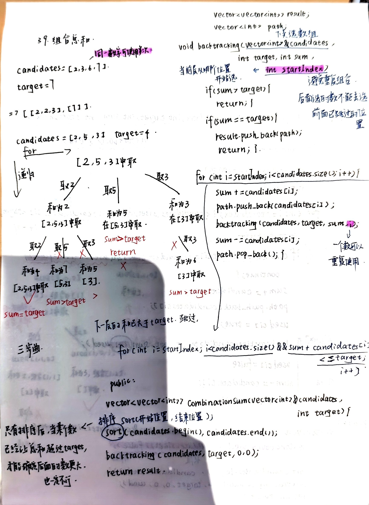
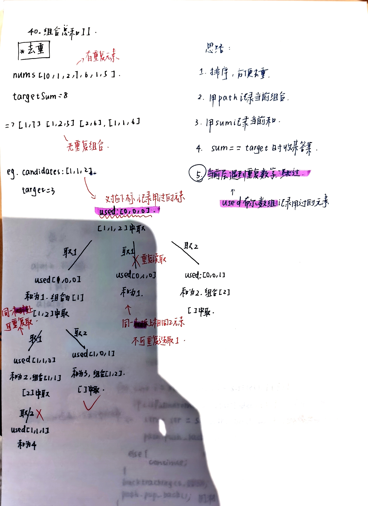
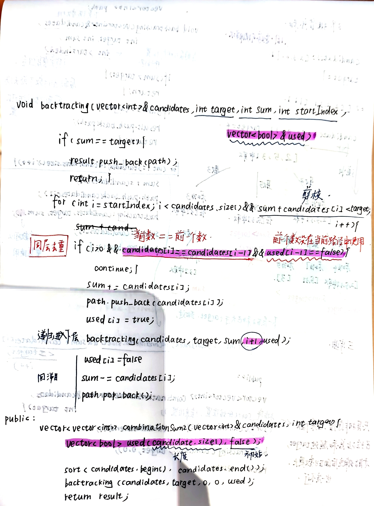
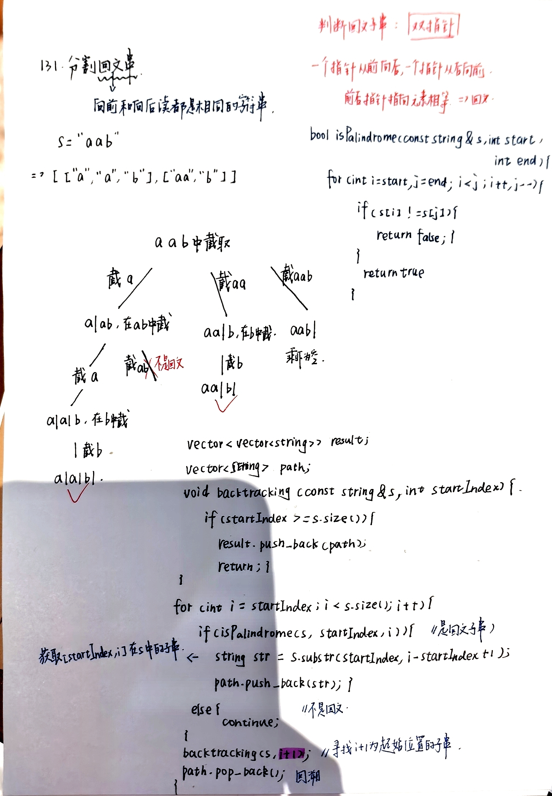

# 回溯part02
- [39.组合总和](https://leetcode.cn/problems/combination-sum/description/)
  - 这题使用回溯来枚举所有组合。
  - 用 path 保存当前组合，用 sum 保存当前组合的和。
  - 当 sum == target 时，将当前路径加入结果集。
  - 为了避免重复组合，递归时使用 startIndex 控制下一层只能从当前位置及其后面继续选择。
  - 由于题目允许同一个元素重复使用，因此递归进入下一层时传入的是当前下标 i，而不是 i+1。
  - 同时先对数组排序，这样当 sum + candidates[i] > target 时，可以直接停止当前层遍历，从而实现剪枝优化。
    
- [40.组合总和II](https://leetcode.cn/problems/combination-sum-ii/description/)
  - 先排序，让相同元素挨在一起。
  - 在回溯时，如果当前元素和前一个元素相同，需要判断前一个元素是不是在当前路径里。
  - 如果前一个元素没有在当前路径里，也就是 used[i - 1] == false，说明前一个相同元素是在同一层已经被尝试过了，这时候当前元素再作为这一层的起点，会生成重复结果，所以要跳过。
  - 但如果前一个元素已经在当前路径里，也就是 used[i - 1] == true，说明当前元素是在同一条树枝上被选择的，这种情况是允许的，不能跳过。
  - 所以这题本质上是只去掉“同一树层”的重复分支，而保留“同一树枝”的合法分支。
    
    
- [131.分割回文串]()
  - 切割问题可以抽象为组合问题
  - 如何模拟那些切割线
  - 切割问题中递归如何终止
  - 在递归循环中如何截取子串
  - 如何判断回文
    
