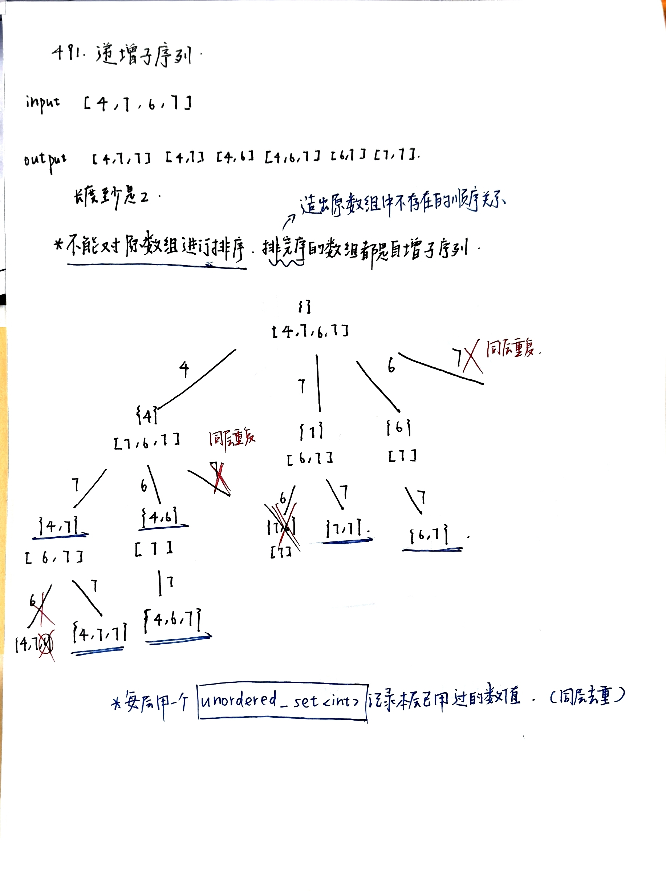
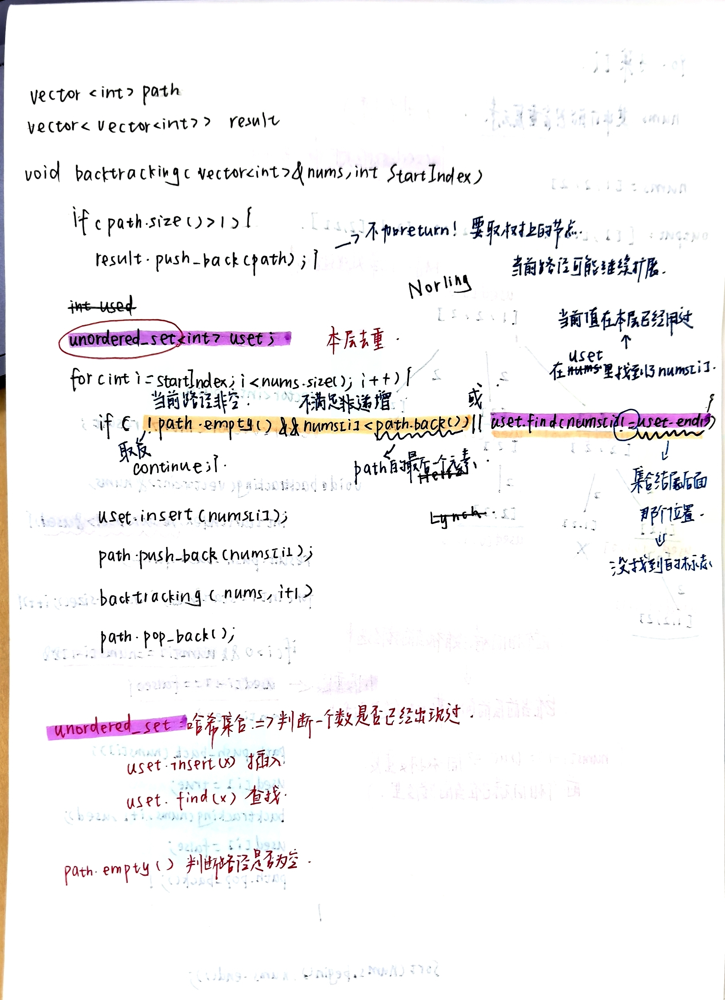
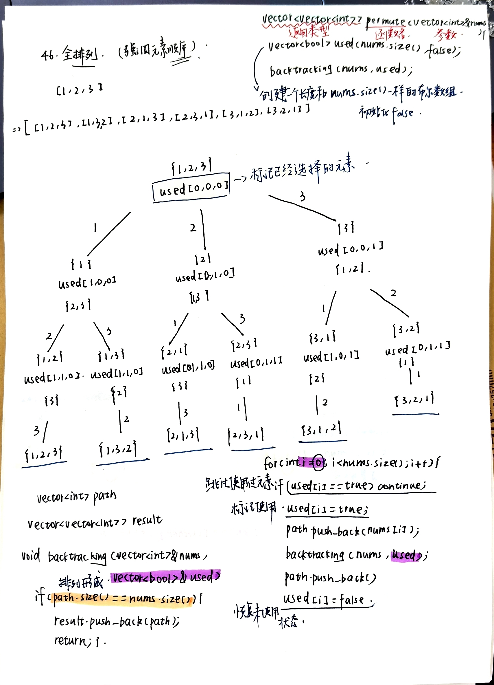
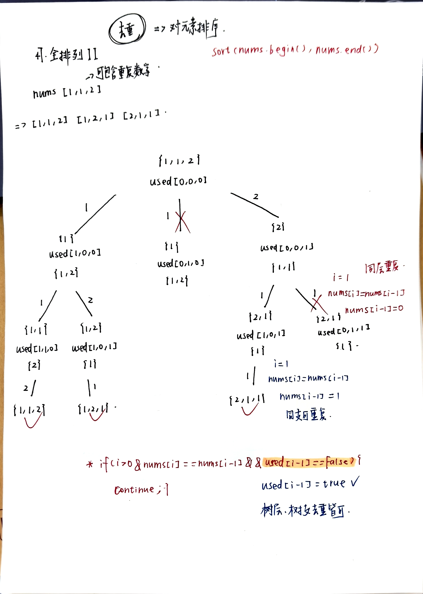

#回溯part04
- [491.递增子序列](https://leetcode.cn/problems/non-decreasing-subsequences/description/)
  - 非递减子序列这题不能排序，因为子序列必须保持原顺序；因此去重不能靠排序后比较相邻元素，而要靠每层单独使用一个 set 记录本层已经使用过的值
    
    
- [46.全排列](https://leetcode.cn/problems/permutations/description/)
  - 排列题每一层都要从头考虑所有还没用过的元素
  - 这题使用回溯来求所有排列。用 path 记录当前已经选择的元素顺序，用 used 数组记录哪些位置的元素已经被使用。
  - 当 path 的长度等于数组长度时，说明当前得到一个完整排列，将其加入结果集。
  - 在递归过程中，每一层都从 0 开始遍历整个数组，遇到还没有使用过的元素就加入路径，并递归进入下一层，递归返回后再回溯。
  - 排列问题不使用 startIndex，因为排列关注顺序，当前层选了某个元素后，下一层仍然需要从整个数组中寻找其余未使用元素，而不能只从后面选
    
- [47.全排列II](leetcode.cn/problems/permutations-ii/description/)
  - **去重**
    
